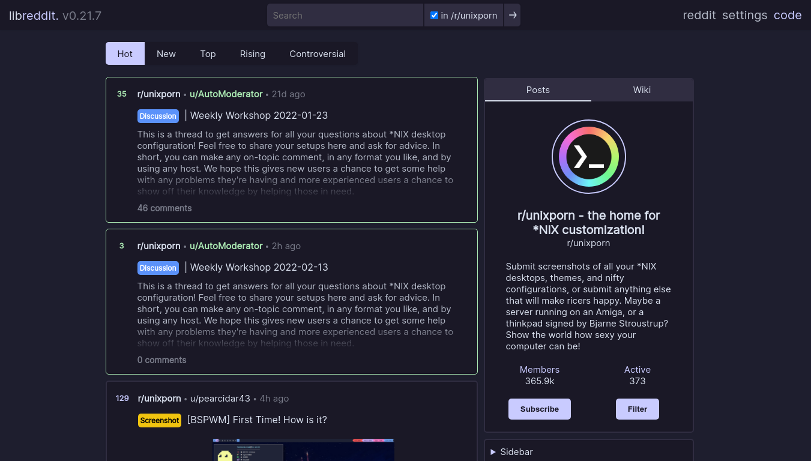

<h3 align="center">
	 
	
	Catppuccin for Libreddit
	
</h3>

    
    
    

## Usage

1. Copy the contents of `libreddit.css` to a css injector like [Stylus](https://github.com/openstyles/stylus).
2. Change the first line from `.catppuccin` to `.dark`.
3. Add the URL of the libreddit instance to the list of domains which the theme applies.
4. Enjoy!

## 💝 Thanks to

- [Andreas Grafen](https://github.com/andreasgrafen)

&nbsp;

Copyright &copy; 2021-present <a href="https://github.com/catppuccin" target="_blank">Catppuccin Org</a>

